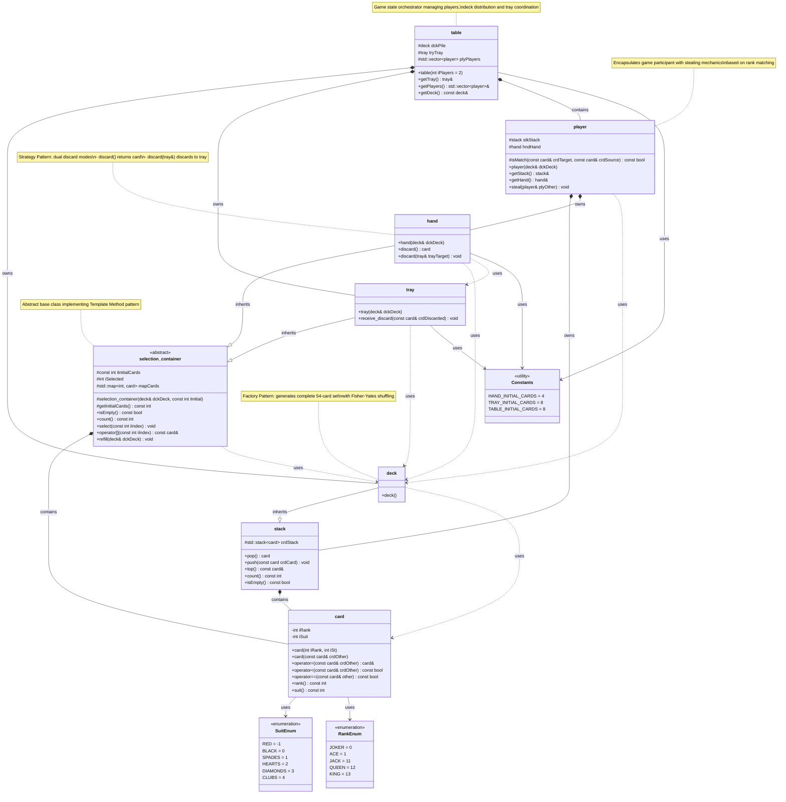

# Roubamonte Class Diagram

## Design Patterns Implemented

- **Template Method Pattern** - `selection_container` abstract base with concrete implementations
- **Strategy Pattern** - Dual discard modes in `hand` class  
- **Factory Pattern** - `deck` auto-generates complete 54-card sets
- **RAII Pattern** - Exception-safe resource management throughout

## Architecture Notes

- **Core Entity**: `card` - Immutable game entity with rank/suit properties
- **Container Hierarchy**: LIFO stack, factory deck, polymorphic selection containers
- **Game Logic**: Player coordination and multi-player table management
- **Extensibility**: Framework supports diverse card-based games through inheritance patterns